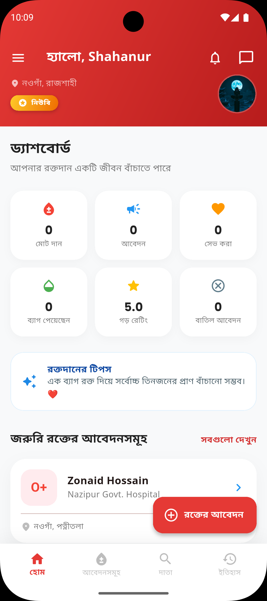
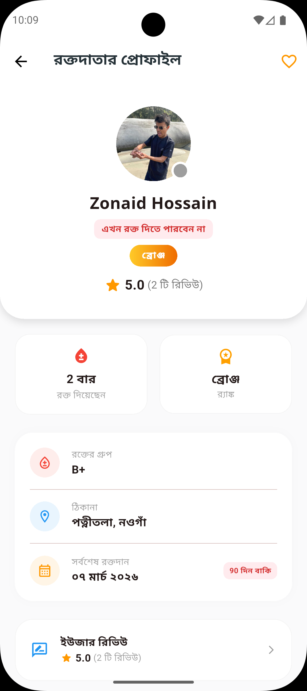
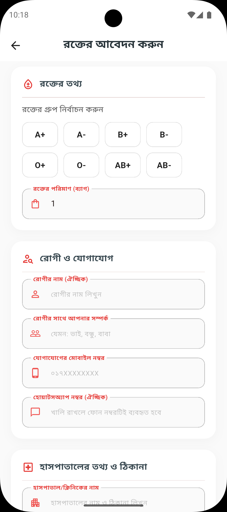
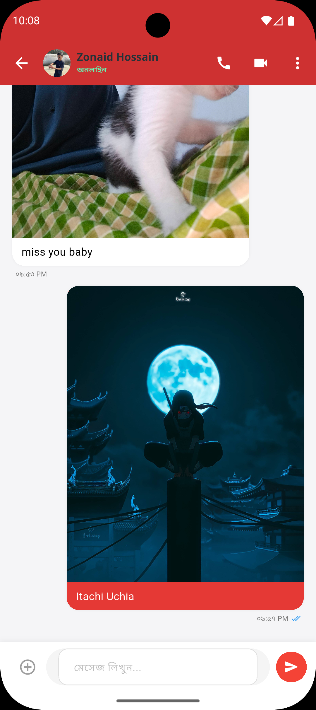
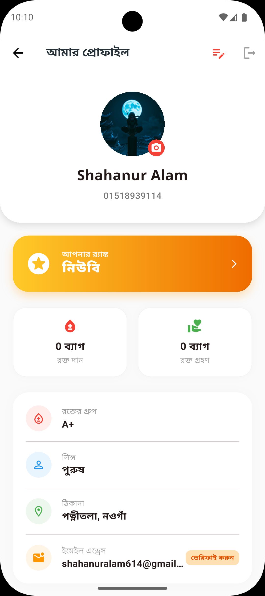
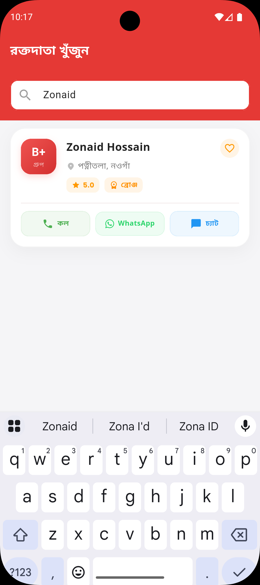

# রক্তদান - Blood Donate 🩸

**A premium, real-time blood donation application designed to save lives through seamless connectivity.**

[](https://flutter.dev)
[](https://firebase.google.com)
[](https://riverpod.dev)
[](https://www.agora.io)
[](https://cloudinary.com)

---

## 📸 App Showcase

| Home Screen | Donor Search | Blood Request |
| :---: | :---: | :---: |
|  |  |  |

| Real-time Chat | User Profile | Advanced Search |
| :---: | :---: | :---: |
|  |  |  |

---

## ✨ Key Features

### 🚀 Advanced Communication
- **Real-time Video & Voice Calls**: Direct and secure communication between donors and recipients via **Agora RTC**.
- **Rich Messaging Engine**: Chat with support for **Images & Videos**, powered by **Cloudinary**.
- **Interactive Media Previews**: Preview images/videos with captions before sending.

### 🩸 Smart Donor Ecosystem
- **Hyper-Local Precision**: Integrated with detailed Bangladeshi location data (Division, District, Upazila, Union).
- **Gamified Ranking System**: Incentivizing donors with ranks from **Newbie** to **Diamond**.
- **Instant Emergency Alerts**: High-visibility blood request cards with location-based notifications.

### 📄 Professional Management
- **PDF Generation**: Download professional donation history reports with full Bengali font support.
- **Dynamic Profile System**: Upload and manage profile pictures with ease.
- **Bi-lingual Interface**: Fully localized experience in both **Bangla** and **English**.

---

## 🛠️ Tech Stack & Architecture

- **Frontend**: Flutter (Dart)
- **State Management**: [Riverpod](https://riverpod.dev/) (Refined logic and data flow)
- **Real-time Backend**: Firebase (Firestore, Cloud Messaging, Auth, Storage)
- **Media Engine**: Cloudinary (High-speed image/video hosting)
- **RTC Engine**: Agora RTC SDK
- **Architecture**: Clean Architecture (Layered separation of concerns)

---

## 🚀 Getting Started

1. **Clone the repository**:
   ```bash
   git clone https://github.com/shahanuralamofficial/blood_donate.git
   ```

2. **Configure Services**:
   - Update `google-services.json` in `android/app/`.
   - Update your **Agora App ID** and **Cloudinary Credentials** in the `core/services` folder.

3. **Install & Run**:
   ```bash
   flutter pub get
   flutter run
   ```

---

## 📄 License
This project is licensed under the MIT License - see the [LICENSE](LICENSE) file for details.

---
<p align="center">
  <b>Developed with ❤️ for the Community.</b><br>
  <i>"Your one drop of blood can save a life today."</i>
</p>
